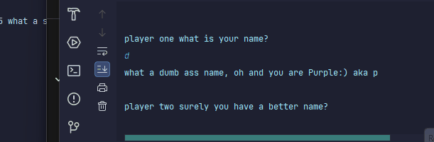
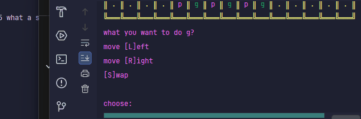
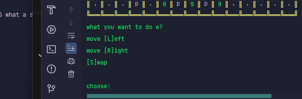
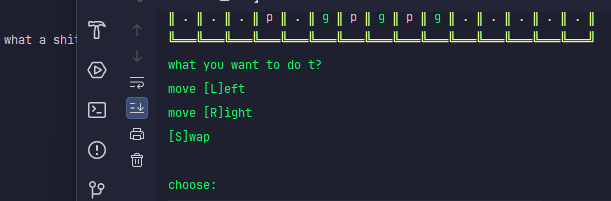

# Results of Testing

The test results show the actual outcome of the testing, following the [Test Plan](test-plan.md)

---

## Testing if counters can swap

### Test Data 

I what to see if it will not swap if square is empty - boundary

### Expected result

---

## Lower and Upper case

### Test Data 

I want to show that lower and upper case work - Valid

### Expected result

---

## Cant go witch way if blocked

## Test data
I want to see that if i go a way that blocked it wont work - invalid

## Expected result

---
It went back to the person turn

## Cant move into a X

## Test data
It must not move into where a X is - boundary

## Expected result

---
It put it back to who's ever turn  it was

## Names

## Test data
Letter should work - Valid

## Expected result

---
Any letter in any order works

## No empty name

## Test data
I want it to repeat if there nothing in name  - invalid

## Expected result

---
It repeats what it siad

## Bored shows up

## Test data
I want bored to show - Valid

## Expected result

---
The bored show up

## Cant put letter in right/left

## Test data
Putting in a letter should not work -invalid

## Expected result

---
It broke the game

## Can the counter move left

## Test data
I will put in an L and it should move left - Valid

## Expected result

---
I put L in and it worked

## Right work
Right work

## Test data
I will put an R in -Valid

## Expected result

---
 I put an R in and it moved to the right