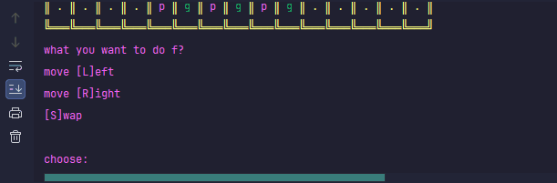
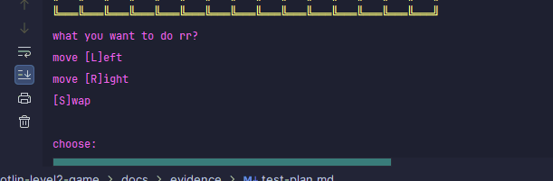
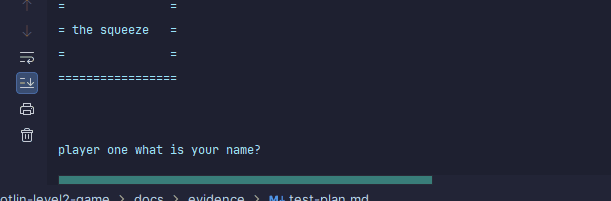
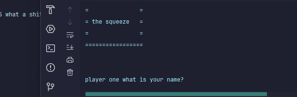

# Results of Testing

The test results show the actual outcome of the testing, following the [Test Plan](test-plan.md)

---

## Testing if counters can swap

test swap
### Test Data Used

Details of test data. Details of test data. Details of test data. Details of test data. Details of test data. Details of test data. Details of test data.

### Test Result

---

## Example Test Name

lower and upper case
### Test Data Used

Details of test data. Details of test data. Details of test data. Details of test data. Details of test data. Details of test data. Details of test data.

### Test Result

---

## test name
cant go witch way if blocked

## test data
i what to see that if i go a way that blocked it wont work

## expeted resault

---
it went back to the preson turn

## test name
cant move into a x

## test data
it must not move into where a x is - boundy

## epxted resualt

---
it put it back to whos ever trun  it was

## test name
names

## test data
letter should work - valind

## epsxted reuslat

---
any letter in any order works

## no emtpy name

## test data
i what it to repet if there nothing in name

## epxted reasult

---
it repets what it siad

## test name
bored shows up

## test data
i what bored to show - valind

## epexted resualt

---
the boread show up

## test name
cant put letter in right/left

## test data
putting in a letter should not work -invaled

## expected resualt

---
it broke the game
## Can the counter move left

## test data
i will put in l and it should move left - valind

## expeted resalut

---
i put l in and it worked

## test name
right work

## test data
i will put a r in -valind

## expected resalut

---
 i put a r in and it moved to the right